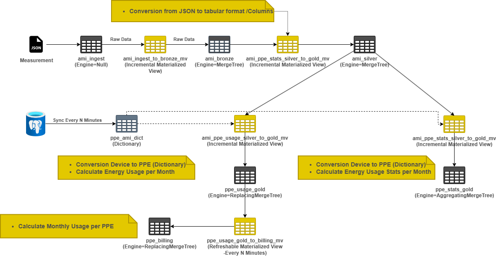
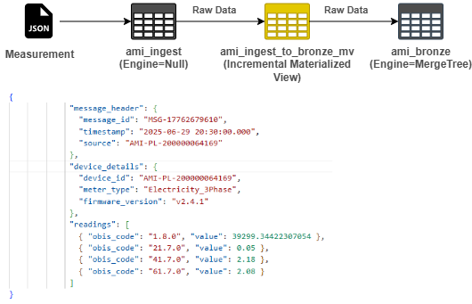
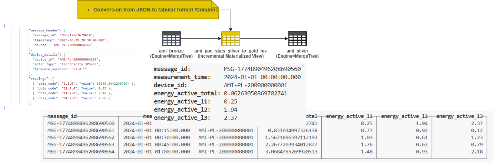
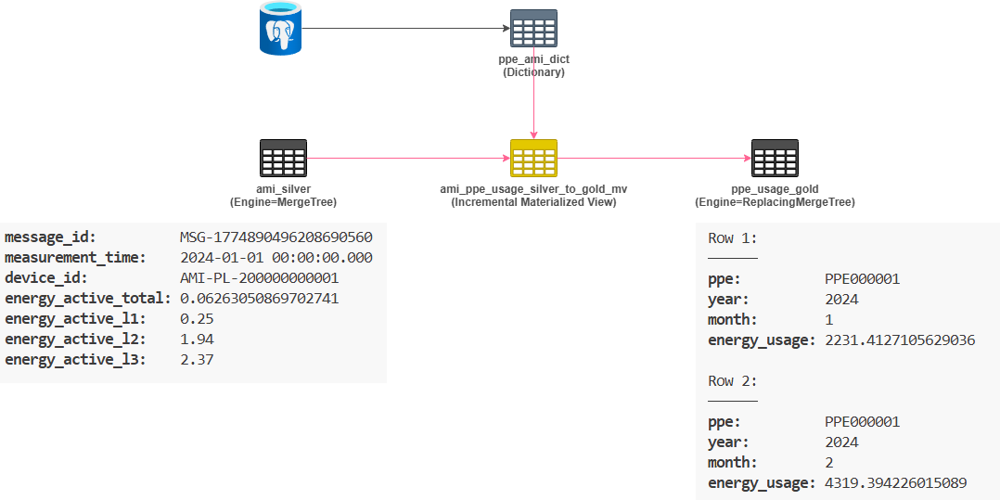
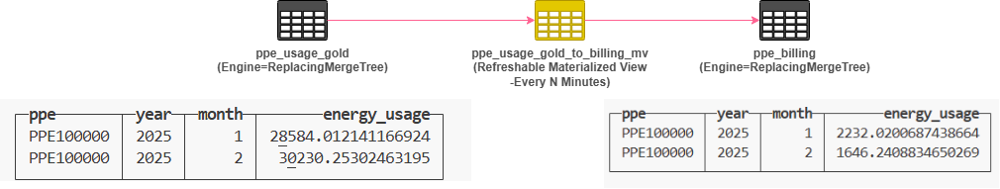
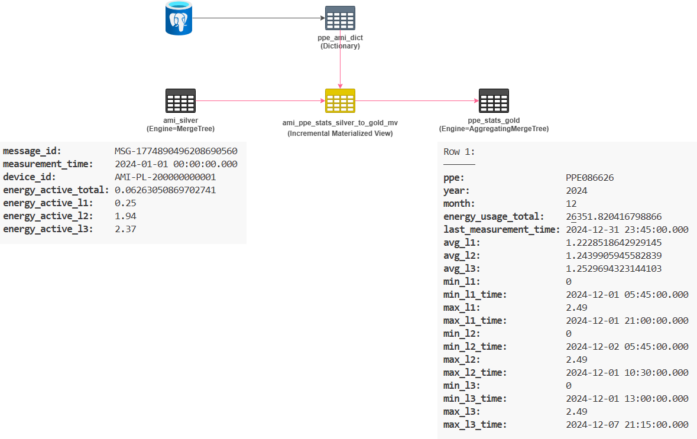

# SQLDay2026 Setup

## Architecture
--------------------------------


--------------------------------
## PostgreSQL
```sql
CREATE TABLE IF NOT EXISTS public.ppe_ami (
    ppe varchar(50) NOT NULL,
    ami varchar(255) NOT NULL,
    trafo_nr varchar(50) NOT null,
    CONSTRAINT pk_ppe_ami PRIMARY KEY (ppe, ami)
);
```
```sql
CREATE UNIQUE INDEX IF NOT EXISTS idx_unique_ppe_ami 
ON public.ppe_ami (ppe, ami);
```
```sql
INSERT INTO public.ppe_ami
SELECT 
    'PPE' || lpad(s.id::text, 6, '0'),
    'AMI-PL-200000' || lpad(s.id::text, 6, '0'),
    'TRAFO-' || lpad((floor(random() * 500) + 1)::text, 3, '0')
FROM generate_series(1, 100000) AS s(id);
```

--------------------------------
## ClickHouse
Create database
```sql
CREATE DATABASE IF NOT EXISTS SQLDay2026;
```
Use database
```sql
USE SQLDay2026
```
--------------------------------
### Data ingestion



Create "ingest" table

```sql
CREATE TABLE IF NOT EXISTS ami_ingest
(
    ts DateTime64(3) DEFAULT now64(),
    msg JSON
)
ENGINE = Null;
```
--------------------------------
Create BRONZE table

```sql
CREATE TABLE IF NOT EXISTS ami_bronze
(
    ts DateTime64(3) DEFAULT now64(),
    msg JSON
)
ENGINE = MergeTree
ORDER BY toDate(ts)
PARTITION BY toYYYYMM(ts)
TTL ts + INTERVAL 3 MINUTE;
```
--------------------------------
Ingest data from INGEST table to BRONZE - Incremental materialized view

```sql
CREATE MATERIALIZED VIEW IF NOT EXISTS ami_ingest_to_bronze_mv
TO ami_bronze AS
SELECT * FROM ami_ingest;
```
--------------------------------
## Bronze to Silver



--------------------------------
Create **silver table**

* energy_active_total - increasing value
* energy_active_l1 - instantaneous value
* energy_active_l2 - instantaneous value
* energy_active_l3 - instantaneous value

```sql
CREATE TABLE IF NOT EXISTS ami_silver
(
     message_id String,
     measurement_time DateTime64(3),
     device_id String,
     energy_active_total Float64,
     energy_active_l1 Float64,
     energy_active_l2 Float64,
     energy_active_l3 Float64
)
ENGINE = MergeTree
ORDER BY (device_id, toDate(measurement_time));
```
--------------------------------
Ingest data from BRONZE table to SILVER - Incremental materialized view

```sql
CREATE MATERIALIZED VIEW IF NOT EXISTS ami_bronze_to_silver_mv
TO ami_silver AS
SELECT
    CAST(msg.message_header.message_id, 'String') AS message_id,
    parseDateTimeBestEffort(CAST(msg.message_header.timestamp, 'String')) AS measurement_time,
    CAST(msg.device_details.device_id, 'String') AS device_id,
    maxIf(toFloat64(r.value), r.obis_code = '1.8.0') AS energy_active_total,
    maxIf(toFloat64(r.value), r.obis_code = '21.7.0') AS energy_active_l1,
    maxIf(toFloat64(r.value), r.obis_code = '41.7.0') AS energy_active_l2,
    maxIf(toFloat64(r.value), r.obis_code = '61.7.0') AS energy_active_l3
FROM ami_bronze
ARRAY JOIN CAST(msg.readings, 'Array(JSON)') AS r
GROUP BY
    message_id,
    measurement_time,
    device_id;
```
--------------------------------
## Gold PPE Usage


--------------------------------
Create AMI-PPE dictionary -PostgreSQL

```sql
CREATE DICTIONARY IF NOT EXISTS ppe_ami_dict
(
    ppe String,
    ami String,
    trafo_nr String
)
PRIMARY KEY ppe, ami
SOURCE(POSTGRESQL(PORT 5432 HOST '127.0.0.1' USER 'postgres' PASSWORD 'Monday12' DB 'sqlday2026-ami' TABLE 'ppe_ami' SCHEMA 'public'))
LIFETIME(MIN 0 MAX 300)
LAYOUT(COMPLEX_KEY_HASHED());
```
--------------------------------
GOLD Table -ppe_usage
```sql
CREATE TABLE IF NOT EXISTS ppe_usage_gold
(
    ppe String,
    year UInt32,
    month UInt8,
    energy_usage Float64
)
ENGINE = ReplacingMergeTree()
ORDER BY (ppe, year, month);
```
Ingest data from SILVER to GOLD using incremental materialized view
* energy_usage - latest energy_active_total value
    * increasing value
* convertion from ami to ppe
```sql
CREATE MATERIALIZED VIEW IF NOT EXISTS ami_ppe_usage_silver_to_gold_mv
TO ppe_usage_gold AS
SELECT
    d.ppe,
    year(toDate(measurement_time)) AS year,
    month(toDate(measurement_time)) AS month,
    energy_active_total AS  energy_usage
FROM ami_silver as s
JOIN ppe_ami_dict AS d ON s.device_id = d.ami;
```

---
## Gold PPE Billing

Crate table ppe_billing
* energy_usage -month-to-month growth
```sql
CREATE TABLE IF NOT EXISTS ppe_billing
(
    ppe String,
    year UInt32,
    month UInt8,
    energy_usage Float64
)ENGINE = ReplacingMergeTree()
ORDER BY (ppe, year, month);
```

Ingest Data to ppe_billing using refreshable materialized view (with filters)
```sql
CREATE MATERIALIZED VIEW IF NOT EXISTS ppe_usage_gold_to_billing_mv
REFRESH EVERY 5 MINUTE TO ppe_billing AS
SELECT
    ppe,
    year,
    month,
    energy_usage - lagInFrame(energy_usage) OVER (
        PARTITION BY ppe
        ORDER BY year ASC, month ASC
    ) AS energy_usage 
FROM ppe_usage_gold FINAL
WHERE makeDate(year, month, 1) >= toStartOfMonth(makeDate(2025, 1, 1)) - INTERVAL 2 MONTH;
```
---
## Gold PPE Stats


Create table ppe_stats_gold

| Column Name | Description |
| --- | --- |
| ppe | PPE id |
| year | Year |
| month | Month |
| energy_usage | Last measured value for ppe per year per month |
| last_measurement_time | Last measured timestamp for ppe per year per month |
| avg_energy_usage_l1 | Avg measured value L1 for ppe per year per month |
| avg_energy_usage_l2 | Avg measured value L2 for ppe per year per month |
| avg_energy_usage_l3 | Avg measured value L3 for ppe per year per month |
| min_energy_usage_l1 | Min measured value L1 for ppe per year per month |
| min_energy_usage_l2 | Min measured value L2 for ppe per year per month |
| min_energy_usage_l3 | Min measured value L3 for ppe per year per month |
| min_ts_energy_usage_l1 | Time of occurrence of the minimum value L1 for ppe per year per month |
| min_ts_energy_usage_l2 | Time of occurrence of the minimum value L3 for ppe per year per month |
| min_ts_energy_usage_l3 | Time of occurrence of the minimum value L3 for ppe per year per month |
| max_energy_usage_l1 | Max measured value L1 for ppe per year per month |
| max_energy_usage_l2 | Max measured value L2 for ppe per year per month |
| max_energy_usage_l3 | Max measured value L3 for ppe per year per month |
| max_ts_energy_usage_l1 | Time of occurrence of the maximum value L1 for ppe per year per month |
| max_ts_energy_usage_l2 | Time of occurrence of the maximum value L3 for ppe per year per month |
| max_ts_energy_usage_l3 | Time of occurrence of the maximum value L3 for ppe per year per month |

```sql
CREATE TABLE IF NOT EXISTS ppe_stats_gold
(
    ppe String,
    year UInt32,
    month UInt8,
    energy_usage AggregateFunction(max, Float64),
    last_measurement_time AggregateFunction(max, DateTime64(3)),
    avg_energy_usage_l1 AggregateFunction(avg, Float64),
    avg_energy_usage_l2 AggregateFunction(avg, Float64),
    avg_energy_usage_l3 AggregateFunction(avg, Float64),
    min_energy_usage_l1 AggregateFunction(min, Float64),
    min_energy_usage_l2 AggregateFunction(min, Float64),
    min_energy_usage_l3 AggregateFunction(min, Float64),
    min_ts_energy_usage_l1 AggregateFunction(argMin, DateTime64(3), Float64),
    min_ts_energy_usage_l2 AggregateFunction(argMin, DateTime64(3), Float64),
    min_ts_energy_usage_l3 AggregateFunction(argMin, DateTime64(3), Float64),
    max_energy_usage_l1 AggregateFunction(max, Float64),
    max_energy_usage_l2 AggregateFunction(max, Float64),
    max_energy_usage_l3 AggregateFunction(max, Float64),
    max_ts_energy_usage_l1 AggregateFunction(argMax, DateTime64(3), Float64),
    max_ts_energy_usage_l2 AggregateFunction(argMax, DateTime64(3), Float64),
    max_ts_energy_usage_l3 AggregateFunction(argMax, DateTime64(3), Float64)
)
ENGINE = AggregatingMergeTree()
ORDER BY (ppe, year, month);
```

Ingest data from SILVER to GOLD ppe_stats_gold using incremental materialized view 
and AggregatingMergeTree Engine

```sql
CREATE MATERIALIZED VIEW IF NOT EXISTS ami_ppe_stats_silver_to_gold_mv
TO ppe_stats_gold AS
SELECT
    ppe.ppe,
    toYear(ami.measurement_time) AS year,
    toMonth(ami.measurement_time) AS month,
    maxState(ami.energy_active_total) AS energy_usage,
    maxState(ami.measurement_time) AS last_measurement_time,
    -- Averages
    avgState(ami.energy_active_l1) AS avg_energy_usage_l1,
    avgState(ami.energy_active_l2) AS avg_energy_usage_l2,
    avgState(ami.energy_active_l3) AS avg_energy_usage_l3,
    -- Minimums
    minState(ami.energy_active_l1) AS min_energy_usage_l1,
    minState(ami.energy_active_l2) AS min_energy_usage_l2,
    minState(ami.energy_active_l3) AS min_energy_usage_l3,
    -- Timestamps of Minimums (Using argMinState)
    argMinState(ami.measurement_time, ami.energy_active_l1) AS min_ts_energy_usage_l1,
    argMinState(ami.measurement_time, ami.energy_active_l2) AS min_ts_energy_usage_l2,
    argMinState(ami.measurement_time, ami.energy_active_l3) AS min_ts_energy_usage_l3,
    -- Maximums
    maxState(ami.energy_active_l1) AS max_energy_usage_l1,
    maxState(ami.energy_active_l2) AS max_energy_usage_l2,
    maxState(ami.energy_active_l3) AS max_energy_usage_l3,
    -- Timestamps of Maximums (Using argMaxState)
    argMaxState(ami.measurement_time, ami.energy_active_l1) AS max_ts_energy_usage_l1,
    argMaxState(ami.measurement_time, ami.energy_active_l2) AS max_ts_energy_usage_l2,
    argMaxState(ami.measurement_time, ami.energy_active_l3) AS max_ts_energy_usage_l3
FROM ami_silver AS ami
JOIN ppe_ami_dict AS ppe ON ami.device_id = ppe.ami
GROUP BY 
    ppe, 
    year, 
    month;
```
Create final vw_ppe_stats
```sql
CREATE VIEW IF NOT EXISTS vw_ppe_stats AS
SELECT
    ppe,
    year,
    month,
    maxMerge(energy_usage) AS energy_usage_total,
    maxMerge(last_measurement_time) AS last_measurement_time,

    avgMerge(avg_energy_usage_l1) AS avg_l1,
    avgMerge(avg_energy_usage_l2) AS avg_l2,
    avgMerge(avg_energy_usage_l3) AS avg_l3,
    minMerge(min_energy_usage_l1) AS min_l1,
    argMinMerge(min_ts_energy_usage_l1) AS min_l1_time,
    maxMerge(max_energy_usage_l1) AS max_l1,
    argMaxMerge(max_ts_energy_usage_l1) AS max_l1_time,

    minMerge(min_energy_usage_l2) AS min_l2,
    argMinMerge(min_ts_energy_usage_l2) AS min_l2_time,
    maxMerge(max_energy_usage_l2) AS max_l2,
    argMaxMerge(max_ts_energy_usage_l2) AS max_l2_time,

    minMerge(min_energy_usage_l3) AS min_l3,
    argMinMerge(min_ts_energy_usage_l3) AS min_l3_time,
    maxMerge(max_energy_usage_l3) AS max_l3,
    argMaxMerge(max_ts_energy_usage_l3) AS max_l3_time

FROM ppe_stats_gold
GROUP BY
    ppe,
    year,
    month
ORDER BY
    year DESC,
    month DESC;
```

## Extra

```sql
SELECT
    name,
    type,
    sorting_key,
    query
FROM system.projections
WHERE database = 'SQLDay2026'
  AND table = 'ami_silver';
```
```sql
 ALTER TABLE ami_silver
    (DROP PROJECTION IF EXISTS avg_energy_active_l1_proj)
```

```sql
ALTER TABLE ami_silver
    (ADD PROJECTION IF NOT EXISTS avg_energy_active_l1_proj
    (
        SELECT
        avg(energy_active_l1) AS avg_energy_active_l1
    ))
```
```sql
ALTER TABLE ami_silver MATERIALIZE PROJECTION avg_energy_active_l1_proj
```

```sql
SELECT *
FROM system.mutations
WHERE database = 'SQLDay2026' 
AND table ='ami_silver' 
FORMAT Vertical
```

```sql
 ALTER TABLE ami_silver
    (DROP PROJECTION IF EXISTS avg_energy_active_l2_proj)
```